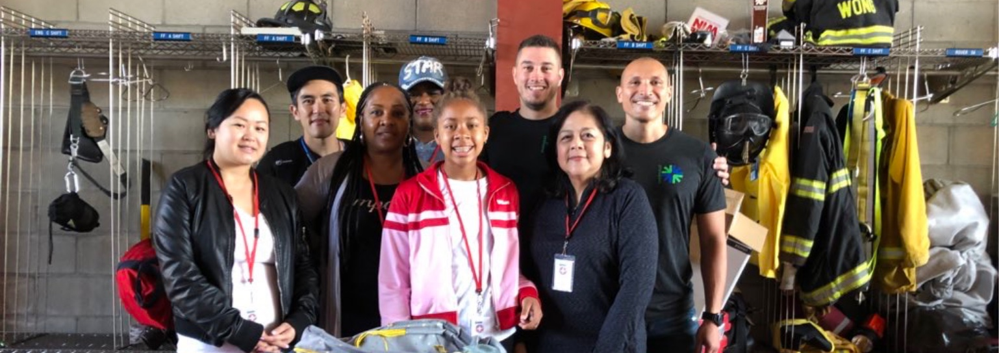
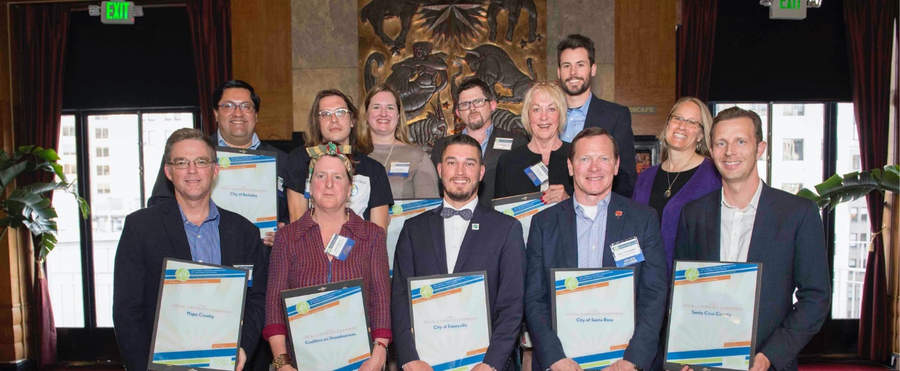

John Bauters is a progressive leader serving on the Emeryville Council since 2016. John brings a combination of professional and lived experience in addressing many of the issues facing residents in the East Bay to his role as a council member.

John has been fighting the structural and societal causes of poverty for over 15 years. A former disaster relief director and eviction defense attorney, he currently works as a public policy and finance expert on the issues of homelessness, criminal justice reform, and community-based mental health services.

In 2018, John championed Emeryville Measure C, a $50 million affordable housing bond that will leverage additional regional, state and federal dollars to build hundreds of new affordable housing units for very low-income families, seniors on fixed incomes, artists, and people experiencing homelessness here in Emeryville. He also helped pass Emeryville's Tenant Protection & Just Cause Eviction and Smoke-Free Housing Ordinances.

John has been an outspoken leader on people-oriented cities, safe streets, and equitable transportation choices. Under his leadership, Emeryville is transforming from a car-dependent community to one that prioritizes walking, biking, and transit. In 2022 he was elected Chair of the Alameda County Transportation Commission, where he spearheaded creation of the county's first Race & Equity Action Plan (REAP), the creation of the first County Bikeways Network, and has integrated climate action goals into the funding priority of the Commission.

The Alameda County Mayors Conference elected John to represent Alameda County’s cities on the Bay Area Air Quality Management District Board of Directors in 2018. John championed the creation of the District’s Community Health, Equity and Justice Committee, oversaw the process leading to the adoption of Rule 6-5, one of the most stringent air quality regulations on refineries anywhere in the world, and led the effort to adopt amendments to Rules 9-4 and 9-6 to create the first zero NOx emission standard for water heaters and gas furnaces in the United States. John has been Chair of the Alameda County Lead Poisoning Prevention Agency since 2016, where he has led the agency's effort to eliminate lead hazards in East Bay homes and schools.

John received his Bachelor’s Degree in Government and Psychology from the University of Notre Dame and his Juris Doctor in law from Boston College Law School. He volunteers at the Emeryville Citizen’s Assistance Program (ECAP) and is a member of the Temescal Creek Community Organic Garden, both here in Emeryville. It’s not uncommon to find him out for a walk with his dog, Reyna, or on a bike ride along the Bay Trail.

### Local Committee & Regional Board Assignments

#### Emeryville

* [Budget & Governance Committee](http://emeryville.org/1080/Budget-and-Governance-Committee) (Chair)
* [Transportation Committee](http://emeryville.org/107/Public-Works-Committee) (Chair)

#### Regional Boards

* [Alameda County Healthy Homes JPA](https://www.achhd.org/) (Chair)
* [Alameda County Transportation Commission](https://www.alamedactc.org/) (Chair)
* [Bay Area Air Quality Management District](https://www.baaqmd.gov/) (Chair)
* [California Association of Council of Governments](https://www.calcog.org/) (Board Member)
* [East Bay Community Energy](https://ebce.org/) (Board Member)

